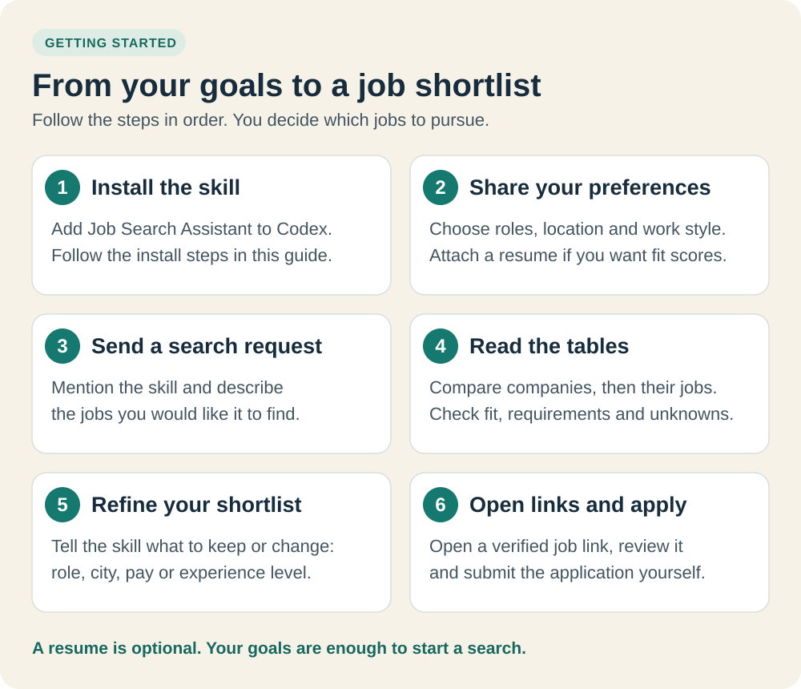
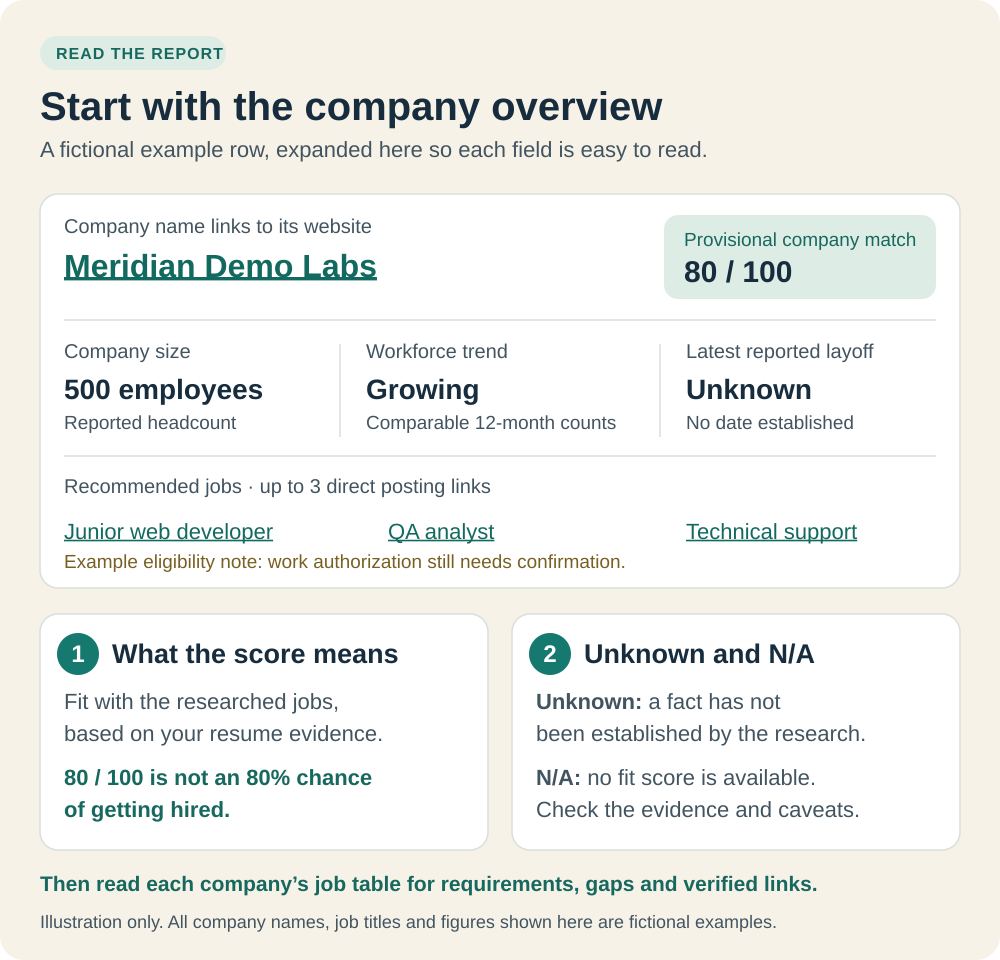

# Detailed usage guide

[Back to the README](../README.md) · [Sample report](report-preview.md)

## Use the skill

Follow these six steps in your agent's conversation. You do not need to run Python commands for normal use. The agent needs to support skills, read your supplied files, and have an authorized way to search and verify current jobs.



### 1. Install the skill once

Already installed? Go to step 2. For a first installation in Codex, copy this into a conversation:

```text
Use $skill-installer to install job-search-assistant from
https://github.com/HuskyCanCode/job-search-assistant.
The skill is at the repository root, where SKILL.md is located.
If it is already installed, tell me where it is and preserve existing changes.
```

This repository is private, so your GitHub account must have access. Use your existing authenticated connection; do not paste passwords or access tokens into a prompt. Other users need repository access from the owner before they can install it.

The installer reports the installation location. In your next message, ask to use `$job-search-assistant`; Codex normally discovers new skills automatically. If it does not appear, restart Codex. The exact picker depends on the product: Codex CLI and IDE support `$` or `/skills`, while ChatGPT uses `@` to select an available skill. This standalone repository is not a published plugin. See the [official skill documentation](https://learn.chatgpt.com/docs/build-skills) for supported products and local setup.

For manual installation, copy the **whole repository folder**, including `SKILL.md`, `references/`, `scripts/`, and `assets/`, into a skill location supported by your agent and name it `job-search-assistant`. Use your agent's documented location or the installer's reported destination; avoid creating duplicate installations or overwriting local changes.

### 2. Share your background and preferences

Attach a readable PDF or DOCX resume if your app supports attachments, provide a local file the agent can read, or paste a professional summary. A resume is optional. Include your target country and preferred work arrangement so the agent can search the right market.

| Tell the skill | Example | When needed |
| --- | --- | --- |
| Country and locations | United States; open to relocation | Needed to define the search market |
| Work arrangement | On-site, hybrid, or remote | Needed; remote jobs can still restrict where you live |
| Roles or direction | Junior developer, QA, or technical support | Optional if you want roles suggested from your background |
| Experience | Resume, or relevant work, skills and projects | Needed for evidence-based personal match scores |
| Employment and salary | Full-time; prefer USD 60,000+ annual base pay | Optional; say whether it is a preference or a firm minimum |
| Hard limits | No travel; sponsorship required | Include any that apply; the skill will not infer them |

You can remove contact details before sharing your resume. Search queries use general skills, role titles and locations; using this skill does not authorize uploading your resume to job boards. Without a resume or sufficiently detailed profile, jobs can still be found, but personal and company match ratings remain **N/A**.

### 3. Send your first search request

Here is a complete example. Change the location and preferences to yours, and attach your resume if you refer to one:

```text
Use $job-search-assistant and my attached resume.

Find jobs in the United States. I prefer on-site work and am open to relocation.
Suggest suitable roles based on my experience, including related job titles.
I am looking for full-time work; salary is flexible.

Target 20 different companies. Show the company overview first, with:
- Each company name linked to its official website
- Company size and a resume-based match rating
- Recent workforce growth or decline and the latest reported layoff
- Up to three recommended job links per company

Then show job details grouped by company, with resume matches, evidence coverage,
eligibility, gaps and application priority. Include reusable search keywords.
Use permitted search tools and employer sources, and explain missing information
or any shortfall against the company target.
```

**What happens next:** the skill reads your background, expands role titles, searches permitted sources, checks original postings, compares requirements and researches companies. If an essential location or work preference is missing, it asks a short question and continues useful preparation. You do not need to choose every job board or approve each permitted read-only search.

Discovery uses parallel query batches, early duplicate removal and shared company research. Actual completion time depends on access and evidence; there is no fixed runtime. The [fast search workflow](../references/search-strategy.md#fast-search-workflow) explains how it avoids repeated work.

### 4. Read the company overview, then the jobs



Start with companies that interest you, then read their detailed job rows. The [sample report preview](report-preview.md) shows the actual table layout.

| What you see | How to use it |
| --- | --- |
| Company size | Employee count or range, with date and scope; this is separate from fit |
| Company match rating | Average of the scored jobs among that company's up to three recommendations; not reputation or hiring odds |
| Job match and evidence coverage | Match shows demonstrated alignment; coverage shows how much of the assessment has known evidence, including known gaps |
| Priority and eligibility | Read these before deciding where to apply. **Review evidence** means the assessment needs checking; **Clarify eligibility** means a material requirement is unknown. A high score does not resolve either issue. |
| Workforce trend and layoffs | Read the dates and sources; employee growth is not inferred from job counts, and a layoff announcement date differs from its effective date |
| Unknown, N/A or provisional | Unknown means a fact is missing; N/A means a score cannot be supported; provisional means the assessment has stated limitations |
| Sources and check dates | See what was actually searched and how recently each posting was checked |

**20 companies means 20 distinct employers**, with up to three suitable recommended jobs each. It does not guarantee 60 jobs. When fewer employers can be substantiated, the report explains the shortfall. Closed, inaccessible or confirmed-ineligible listings do not fill the recommendation quota. “No layoff report found” describes only the sources and period checked.

### 5. Refine or save the shortlist

Reply in the same conversation so the skill can reuse your confirmed preferences. For example:

```text
Keep my location and work preferences. Focus the next search on QA and application
support roles. Exclude internships and roles requiring current student status.
Keep the 20-company target and explain the most important gaps in my best matches.
```

For a deliberately smaller follow-up:

```text
From this report, show only the five companies I should prioritize.
Explain why each one fits and which requirements I should confirm first.
```

For files you can save:

```text
Save this report as Markdown, plus separate company and job CSV files.
Keep my resume and personal report outside the distributable skill repository.
```

### 6. Open a job link and apply yourself

Select a verified job link, check that the employer is still accepting applications, and review the requirements before submitting. Company-name links open the official company site; job-title links open the specific posting. The report does not submit applications or contact employers.

You can ask for preparation help without sending anything. Replace the example title with an actual title or job link from your report:

```text
Compare my resume with the QA Analyst posting in the report.
Suggest truthful resume edits and a short application checklist for me to review.
Do not submit an application or contact the employer.
```

## More prompts to try

Copy one and replace its locations, roles and constraints with your own.

**No resume yet**

```text
Use $job-search-assistant. Find entry-level logistics jobs in Chicago, United States.
I want on-site, full-time work. Include related titles and target 20 companies.
I have not provided my background, so keep personal and company fit ratings N/A.
```

**Unsure which roles fit**

```text
Use $job-search-assistant and my attached resume. Suggest close, adjacent and stretch
roles, then search for suitable openings in the United States. I am open to on-site
work and relocation. Target 20 qualifying employers and show the company-first report.
```

**Explore roles before searching**

```text
Use $job-search-assistant with my resume. For now, suggest roles and reusable keywords
only. Explain how my experience transfers; do not search for live openings yet.
```

**Remote work or a career change**

```text
Use $job-search-assistant. I want to move from hospitality into customer operations.
Use my resume to find remote jobs that allow me to work from Canada. Target 20
companies, compare transferable skills, and flag location or eligibility restrictions.
```

**Include particular job resources**

```text
Use $job-search-assistant. Find junior frontend and software support jobs in New York,
United States, with on-site or hybrid work. Include permitted indexed discovery for
LinkedIn, Indeed and Wellfound, then verify original employer postings. Show which
sources were searched or limited, and keep restricted direct automation disabled.
```

A search runs when requested in the conversation. Background repetition requires a separately requested schedule and a host that supports scheduling; installing the skill alone does not start recurring searches.

## If something does not work

| Situation | What to do next |
| --- | --- |
| The skill is not found | Confirm installation completed and the folder contains `SKILL.md`; mention the skill in a new message. If needed, restart the app and check its documented skill locations. |
| GitHub installation is denied | Confirm your account has access to this private repository and reconnect using your normal authentication flow. Do not share secrets in chat. |
| The resume cannot be read | Supply a text-based PDF, DOCX, or pasted professional summary. A scanned image may need OCR that the host does not have. |
| Only a plan is returned | Check whether a permitted live-search and verification route is available. Without one, current openings cannot be verified; you can still compare supplied job descriptions. |
| Ratings show N/A | Supply enough professional evidence for matching and a complete, verifiable job description. Do not ask the skill to guess a score. |
| Fewer than 20 companies appear | Read the search limits. Broaden role titles, locations or other preferences you are willing to change; keep firm constraints intact. |
| A LinkedIn-only listing cannot be verified | Review it manually or ask for an equivalent employer posting. Restricted direct access stays disabled. |
| A formerly open job has closed | Ask for a fresh check and replacement openings; an earlier check is not a guarantee of current availability. |
